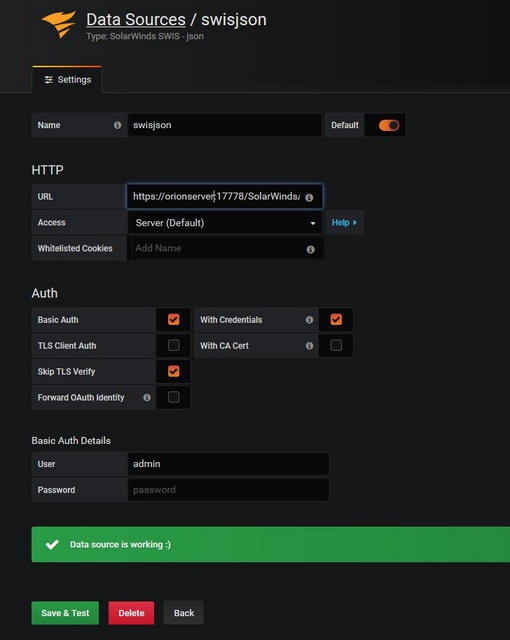

# SolarWinds SWIS React DataSource for Grafana

[](LICENSE)

A Grafana datasource plugin for querying SolarWinds data using SWQL via the SWIS REST API. This plugin allows you to visualize your SolarWinds monitoring data directly in Grafana dashboards.



## Features

- Connect to SolarWinds Information Service (SWIS) over HTTP/HTTPS
- Write SWQL queries to retrieve data
- Create time-series graphs from SWQL queries
- Support for template variables
- Annotation support

## Requirements

- Grafana 10.0.0 or later
- SolarWinds with SWIS REST API access
- Node.js 14+ (for building from source)

## Installation

### From Release

1. Download the latest release ZIP file from the [Releases page](https://github.com/ipm-bobby/grafana-swis-datasource-react/releases)
2. Extract to your Grafana plugins directory (e.g., `/var/lib/grafana/plugins/solarwinds-swis-react-datasource`)
3. Set permissions: `chown -R grafana:grafana /var/lib/grafana/plugins/solarwinds-swis-react-datasource`
4. Enable the unsigned plugin by adding to your Grafana configuration:
   ```ini
   [plugins]
   allow_loading_unsigned_plugins = solarwinds-swis-react-datasource
   ```
   or set the environment variable:
   ```
   GF_PLUGINS_ALLOW_LOADING_UNSIGNED_PLUGINS=solarwinds-swis-react-datasource
   ```
5. Restart Grafana

### Building from Source

1. Clone this repository
2. Install dependencies: `npm install`
3. Build the plugin: `bash build-plugin.sh`
4. Install to your local Grafana (optional): `bash build-plugin.sh --install`
5. The plugin ZIP will be created in the project directory

## Configuration

1. Add a new datasource in Grafana and select "SolarWinds SWIS React DataSource"
2. Configure the SWIS URL (default: `https://localhost:17774/SolarWinds/InformationService/v3/Json/`)
   - Format should be: `https://server:port/SolarWinds/InformationService/v3/Json/`
   - Include the trailing slash `/`
   - "Query" will be added automatically to the URL

3. Choose an Access mode:
   - **Server** (recommended): Requests go through the Grafana server
   - **Browser**: Requests go directly from the browser (may have CORS issues)

4. Configure authentication:
   - For HTTP Basic Auth: Enable Basic Auth and enter your SolarWinds credentials
   - For API Keys: Select the appropriate auth method and configure the key details

5. Enable "Skip TLS Verify" if using a self-signed certificate
6. Click "Save & Test" to verify the connection

## Using the Query Editor

The query editor provides a SQL-like interface for writing SWQL queries:

### Time Series Queries

For time series data, include:
- A timestamp column (can be aliased as "time")
- Numeric value columns
- Time range variables ($from and $to)

Example:
```sql
SELECT 
    datetime as time, 
    Caption as metric,
    CPULoad as value
FROM Orion.CPULoad
WHERE datetime BETWEEN $from AND $to
ORDER BY datetime
```

### Template Variables

Create template variables using SWQL queries:

```sql
SELECT Caption as __text, NodeID as __value FROM Orion.Nodes ORDER BY Caption
```

## Troubleshooting

Check the [TESTING.md](TESTING.md) file for detailed troubleshooting steps.

Common issues:
- URL format must be exactly `https://server:port/SolarWinds/InformationService/v3/Json/`
- Always use "Server" access mode to avoid CORS issues
- Enable "Skip TLS Verify" if using self-signed certificates
- Check Grafana logs for detailed error information

## Contributing

Contributions are welcome! Please feel free to submit a Pull Request.

1. Fork the repository
2. Create your feature branch (`git checkout -b feature/amazing-feature`)
3. Commit your changes (`git commit -m 'Add some amazing feature'`)
4. Push to the branch (`git push origin feature/amazing-feature`)
5. Open a Pull Request

## License

This project is licensed under the Apache License 2.0 - see the [LICENSE](LICENSE) file for details.